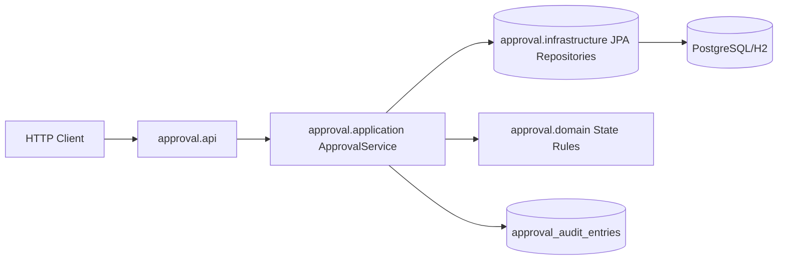

# java-quality-service-lab

Clean, interview-ready Java 21 Spring Boot service that models an approval-request workflow with explicit business rules, structured error handling, and strong test coverage.

> Add a CI badge after publishing to GitHub so the URL points to your actual repository owner and name.

## Quick Start

Prerequisites:

- Java 21
- Maven 3.9+
- Docker (for integration tests and containerized run)

Run locally:

```bash
mvn spring-boot:run
```

Smoke test:

```bash
curl -X POST http://localhost:8080/requests \
  -H "Content-Type: application/json" \
  -d "{\"subject\":\"Laptop Purchase\",\"description\":\"Need replacement device\",\"requestedBy\":\"alice\",\"approver\":\"manager\"}"
```

## Architecture Overview

The project uses a layered, package-by-feature structure to keep business logic testable and easy to explain:

- `approval.api`: HTTP endpoints and request/response DTOs
- `approval.application`: use-case orchestration and state-transition checks
- `approval.domain`: domain entities and state model
- `approval.infrastructure`: Spring Data JPA repositories
- `shared.api`: global exception-to-HTTP mapping

High-level request flow:



Design choices:

- Controllers stay thin; service layer owns business rules.
- Domain model reflects workflow states explicitly (`DRAFT`, `SUBMITTED`, `RETURNED`, `APPROVED`).
- Audit trail is persisted for key decisions (`RETURNED`, `APPROVED`).

## Domain Overview

Core aggregate: `ApprovalRequest`

Fields include:

- request metadata (`subject`, `description`, `requestedBy`, `approver`)
- workflow state (`status`)
- decision metadata (`latestComment`, `decisionAt`)
- lifecycle timestamps (`createdAt`, `updatedAt`)

Business rules:

- New requests start as `DRAFT`
- Only `DRAFT` and `RETURNED` are editable
- Only `DRAFT` and `RETURNED` can be submitted
- Only `SUBMITTED` can be approved or returned
- Return requires a non-blank comment
- Approved requests are immutable
- Approve/return actions produce audit entries

## API Overview

Base resource: `/requests`

- `POST /requests` create draft request
- `GET /requests/{id}` fetch one request
- `GET /requests` list requests (supports filters)
- `PUT /requests/{id}` update editable request
- `POST /requests/{id}/submit` submit draft/returned request
- `POST /requests/{id}/approve` approve submitted request
- `POST /requests/{id}/return` return submitted request
- `GET /requests/{id}/audit` list decision audit history

Example create request:

```json
{
  "subject": "Laptop Purchase",
  "description": "Need replacement device for testing",
  "requestedBy": "alice",
  "approver": "manager"
}
```

Example create response:

```json
{
  "id": "9f48186e-7702-4f90-b6dc-4f5a6ece41ea",
  "subject": "Laptop Purchase",
  "description": "Need replacement device for testing",
  "requestedBy": "alice",
  "approver": "manager",
  "status": "DRAFT",
  "latestComment": null,
  "createdAt": "2026-03-31T18:30:00Z",
  "updatedAt": "2026-03-31T18:30:00Z",
  "decisionAt": null
}
```

Structured error response shape:

- `timestamp`
- `status`
- `error`
- `message`
- `path`
- `validationErrors` (only for validation failures)

Happy-path walkthrough:

1. `POST /requests` creates a new approval request in `DRAFT`.
2. `PUT /requests/{id}` updates draft details.
3. `POST /requests/{id}/submit` moves to `SUBMITTED`.
4. `POST /requests/{id}/return` (with comment) moves to `RETURNED`.
5. `POST /requests/{id}/submit` resubmits to `SUBMITTED`.
6. `POST /requests/{id}/approve` moves to `APPROVED`.
7. `GET /requests/{id}/audit` shows `RETURNED` and `APPROVED` decision history.

## Test Strategy

The suite is intentionally split by test value:

- **Unit tests (`ApprovalServiceTest`)**
  - fast checks for transition rules and negative paths
  - mocked repositories where boundary isolation helps readability
- **Integration tests (`ApprovalRequestApiIntegrationTest`)**
  - HTTP-level contract testing via `MockMvc`
  - validation and error mapping verification
  - end-to-end workflow and audit checks
  - role/actor negative-path checks (`submit`, `approve`) at HTTP level
  - PostgreSQL-backed via Testcontainers for production-like behavior

Run tests:

```bash
# unit only
mvn -Dtest=ApprovalServiceTest test

# integration only (Docker required)
mvn -Dtest=ApprovalRequestApiIntegrationTest test

# full suite
mvn test
```

## Coverage

JaCoCo is integrated into Maven and runs during `verify`.

Quality gates:

- line coverage >= 75%
- branch coverage >= 60%

Commands:

```bash
# run tests + enforce coverage gate
mvn verify

# generate report without enforcing gate
mvn test jacoco:report
```

Coverage report:

- `target/site/jacoco/index.html`

## Key Tradeoffs

- **Service-centric rules vs richer domain model:** keeps the code straightforward for interviews and explicit in one place, at the cost of less domain encapsulation.
- **Repository query methods vs dynamic specifications:** current approach is easy to read for a small domain, but may need refactor as filters grow.
- **Moderate coverage gates (75/60):** promotes quality without making CI too fragile during iterative improvements.
- **Testcontainers for integration tests:** slower than pure in-memory tests, but gives production-like confidence for JPA + SQL behavior.

## CI

GitHub Actions workflow: `.github/workflows/ci.yml`

What it does:

- runs on push and pull request
- sets up Java 21 with Maven dependency caching
- runs `mvn verify`
- uploads test reports and JaCoCo report as artifacts

## Docker

Container strategy:

- multi-stage Docker build
- JRE-only runtime image
- non-root runtime user
- optional runtime JVM tuning via `JAVA_OPTS`

Build:

```bash
docker build -t java-quality-service-lab:local .
```

Run:

```bash
docker run --rm -p 8080:8080 java-quality-service-lab:local
```

Run with JVM options:

```bash
docker run --rm -p 8080:8080 -e JAVA_OPTS="-Xms256m -Xmx512m" java-quality-service-lab:local
```

## Future Improvements

- Add OpenAPI documentation (`springdoc`) for interactive API exploration
- Introduce role-based authorization and audit actor identity from auth context
- Add optimistic-lock conflict tests for concurrent updates
- Add pagination/sorting on `GET /requests`
- Add migration tooling (`Flyway`) for explicit schema evolution
- Add release workflow with image publishing
